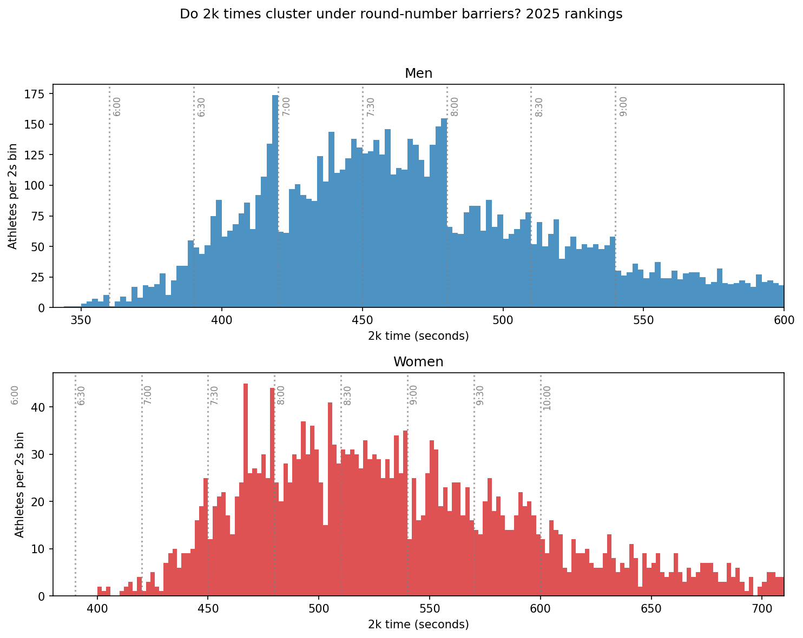

# erg-2k-analysis
## Do rowers' 2km erg times bunch at round numbers? An analysis of 10,500 Concept2 2km scores

I scraped the 2,000 fastest 2k times for men and 2,000 for women from Concept2's
official 2025 rankings, and asked a question about my own behaviour: Do
athletes target round number goal times, calculate the exact splits, and hold
them? (I know I try to!)

## Findings
- Clear bunching just below 7:00 and 8:00 for men, and 8:00 for women — 2× more
  athletes in the 5s below the barrier than the 5s above.
- Bunching at faster barriers was weaker — fewer athletes reach those times,
  so both the crowds and the statistical power shrink.
- Cube law finding: top-200 men average 67% more power than the top-200 women,
  so the speed gap is only 18%
- Athletes reach peak speed at age 20-24 regardless of sex

## Method
Scraped all Concept2 ranked times up to 11:40 min with pandas (rate-limited), cleaned
times to seconds and converted to watts, queried with SQLite, plotted with
Matplotlib. To measure bunching I counted athletes in the 5 seconds below
each round-number barrier against the 5 seconds above it; on a smooth
distribution the two counts should be almost equal, so a large excess below
the barrier indicates clustering.

## Limitations
- Rankings are self-selected — athletes choose to rank, so slow tails are
  underrepresented.
- The scrape covers the top of each ranking; comparisons are made between groups of
  different depth (top-100 men may contain a greater no. of elite athletes to the top-100
  women, so not mean vs mean).
